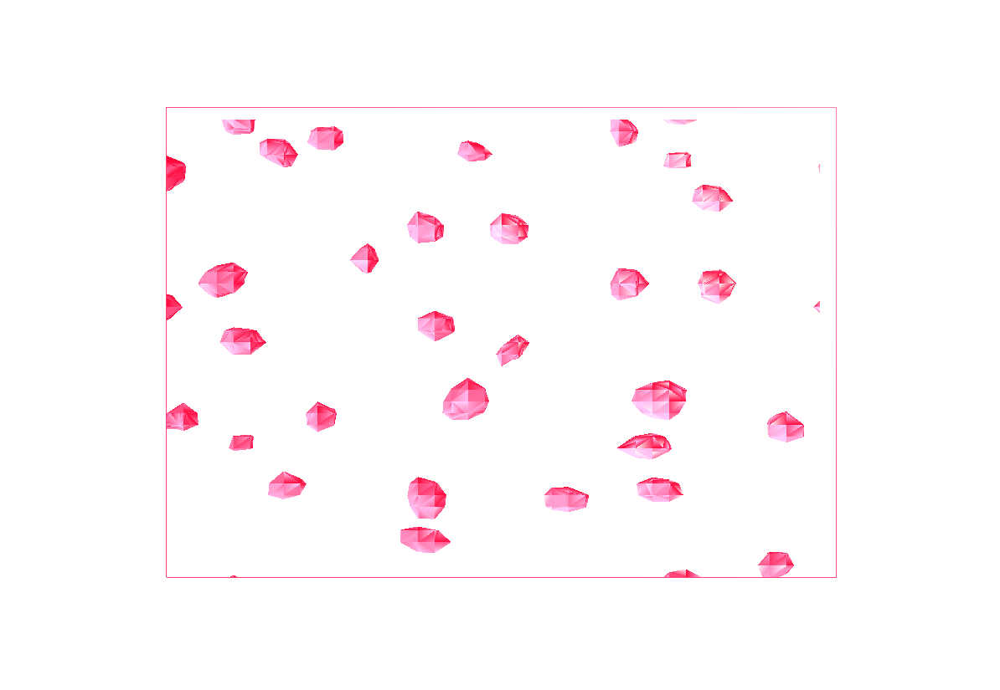
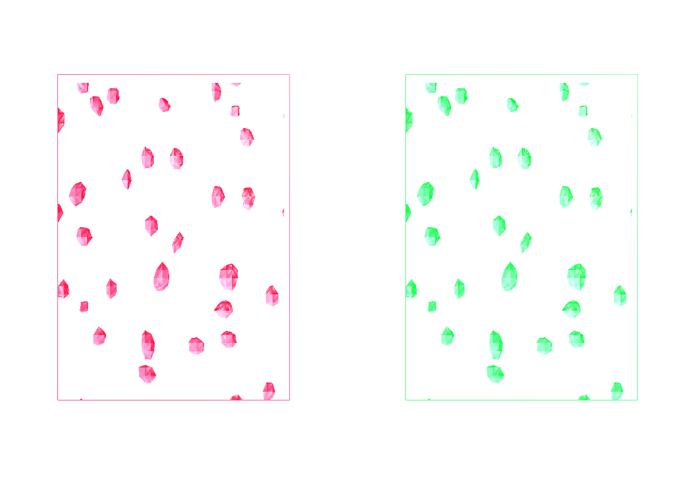
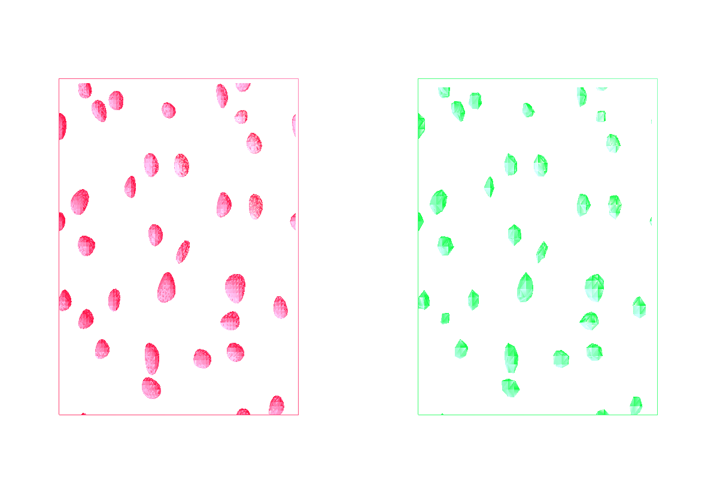
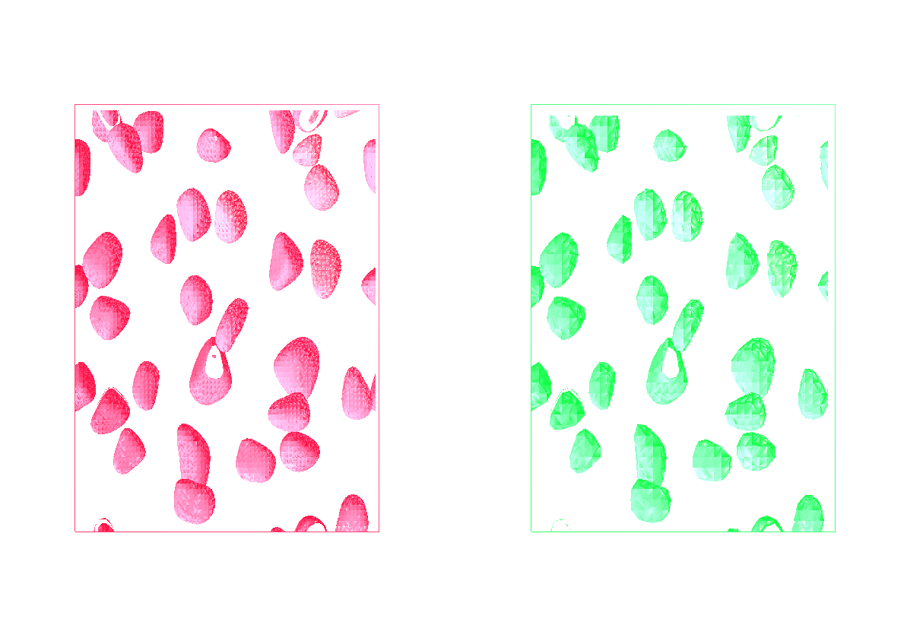
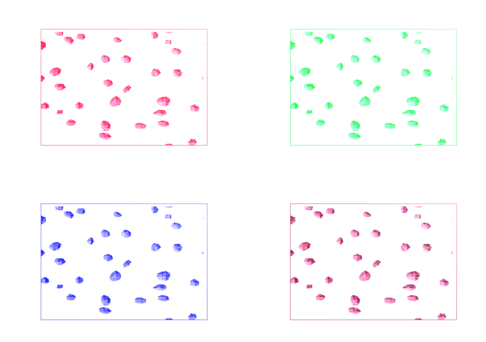
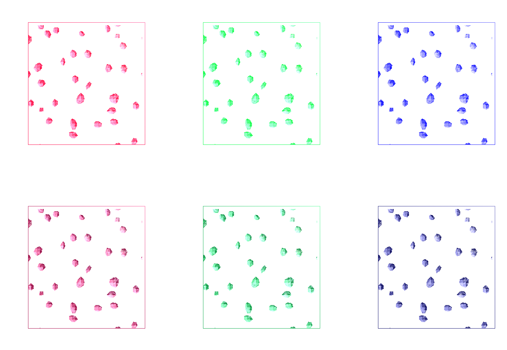
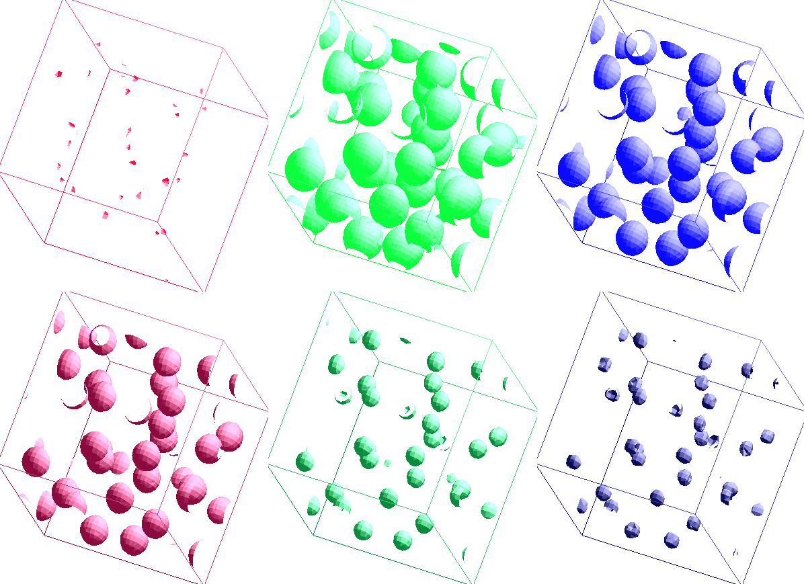
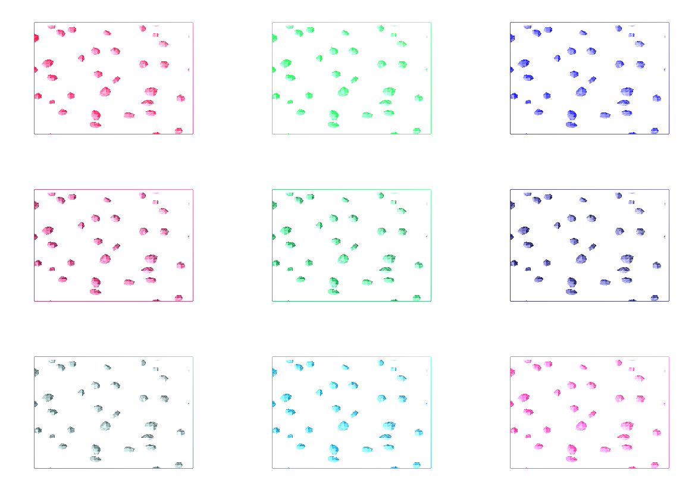

# multiple_isosurface
Multiple Isosurface Extraction of Scalar Volume Data

# Requirements
* Visualize scalar volume data using the Marching Cubes isosurface
extraction method
    * Download the input data “DataDensity” and Marching Cubes code
from the moodle
* Extract isosurfaces for multiple isovalues at the same time
    * Render them on different viewports
* Support a multi-resolution extraction scheme with
    * Isosurfaces for the selected isovalues rendered at high (original)
resolution
    * Isosurfaces for other isovalues rendered at one or more low (reduced) resolutions
* Provide the necessary user interactive options

# Results

Enter one 0.01 isovalues:

Press "a" to add 0.02 to the isovalue: 

Enter two 0.01 isovalues:

Click left view:

Press "a" to add 0.02 to the isovalue: 

Enter three isovalues(0.01, 0.03, 1.03):

Enter four 0.01 isovalues:

Enter six 0.01 isovalues:

Press "k" or "l" to rotate view:

Enter nine 0.01 isovalues:

# Performance

Isovalue length is 1
Loading data cost 0.150219 seconds
Creating list cost 0.003790 seconds
Display 0.010904
Display 0.001258
Display 0.000470
Display 0.000472
Display 0.000421
Display 0.000449
Display 0.000404
Display 0.000412
Display 0.000328
Display 0.000455
Display 0.000262
Display 0.000308
Display 0.000372
Display 0.000301
Display 0.000392
Display 0.000329
Display 0.000268
Display 0.000288
Display 0.000381
Display 0.000410
Display 0.000319
Display 0.000357
Display 0.000308
Display 0.000289
Display 0.000276
Display 0.000415

Isovalue length is 2
Loading data cost 0.172141 seconds
Creating list cost 0.010464 seconds
Display 0.010980
Display 0.001640
Display 0.000797
Display 0.000817
Display 0.000760
Display 0.000813
Display 0.001337
Display 0.003461
Display 0.001878
Display 0.001792
Display 0.001481
Display 0.001438
Display 0.001640
Display 0.001410
Display 0.001423
Display 0.001665
Display 0.001690
Display 0.002017
Display 0.001212

Isovalue length is 3
Loading data cost 0.150763 seconds
Creating list cost 0.010043 seconds
Display 0.011978
Display 0.002045
Display 0.000892
Display 0.000913
Display 0.001183
Display 0.001013
Display 0.001270
Display 0.001201
Display 0.001169
Display 0.001098
Display 0.002389
Display 0.003818
Display 0.002023
Display 0.001279
Display 0.001459
Display 0.001715
Display 0.001454
Display 0.001420
Display 0.001380
Display 0.001817

Isovalue length is 4
Loading data cost 0.166641 seconds
Creating list cost 0.017994 seconds
Display 0.009188
Display 0.001985
Display 0.001303
Display 0.001884
Display 0.001606
Display 0.001641
Display 0.001651
Display 0.001541
Display 0.001771
Display 0.003522
Display 0.001793

Isovalue length is 4
Loading data cost 0.166641 seconds
Creating list cost 0.017994 seconds
Display 0.009188
Display 0.001985
Display 0.001303
Display 0.001884
Display 0.001606
Display 0.001641
Display 0.001651
Display 0.001541
Display 0.001771
Display 0.003522
Display 0.001793

Isovalue length is 6
Loading data cost 0.177353 seconds
Creating list cost 0.027208 seconds
Display 0.016043
Display 0.003514
Display 0.004254
Display 0.002034
Display 0.002140
Display 0.002248
Display 0.002432
Display 0.001905
Display 0.002342
Display 0.002502
Display 0.003775
Display 0.004995
Display 0.002719
Display 0.002725
Display 0.004256
Display 0.002782
Display 0.003879
Display 0.003893
Display 0.003063
Display 0.003187
Display 0.004252

Isovalue length is 7
Loading data cost 0.149115 seconds
Creating list cost 0.028230 seconds
Display 0.015625
Display 0.002585
Display 0.001822
Display 0.001656
Display 0.001932
Display 0.002556
Display 0.002424
Display 0.002134
Display 0.002280
Display 0.002734
Display 0.002395
Display 0.002130
Display 0.002799
Display 0.003178
Display 0.003766
Display 0.003586

Isovalue length is 8
Loading data cost 0.148606 seconds
Creating list cost 0.027310 seconds
Display 0.011133
Display 0.003427
Display 0.005526
Display 0.002795
Display 0.002419
Display 0.002469
Display 0.003023
Display 0.002417
Display 0.003354
Display 0.002528
Display 0.002862
Display 0.002483
Display 0.005163
Display 0.003829
Display 0.004944
Display 0.006995
Display 0.002393
Display 0.004691
Display 0.003244
Display 0.006012
Display 0.003692

Isovalue length is 9
Loading data cost 0.161289 seconds
Creating list cost 0.035812 seconds
Display 0.010493
Display 0.003520
Display 0.003148
Display 0.005405
Display 0.002795
Display 0.002567
Display 0.002969
Display 0.005019
Display 0.005236
Display 0.006244
Display 0.006076
Display 0.003414
Display 0.006854
Display 0.003223
Display 0.005384
Display 0.003408
Display 0.006477
Display 0.003087
Display 0.005101
Display 0.007734
Display 0.002776
Display 0.004844

